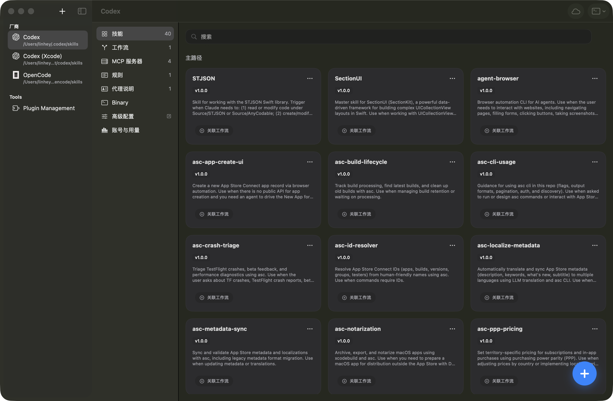
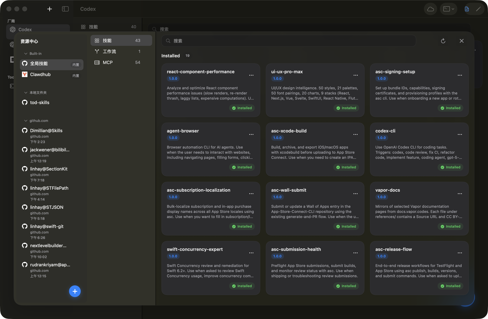
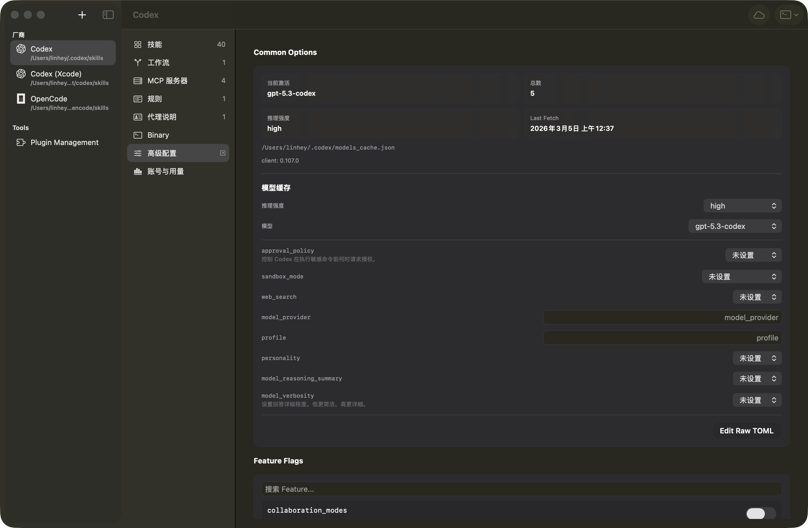
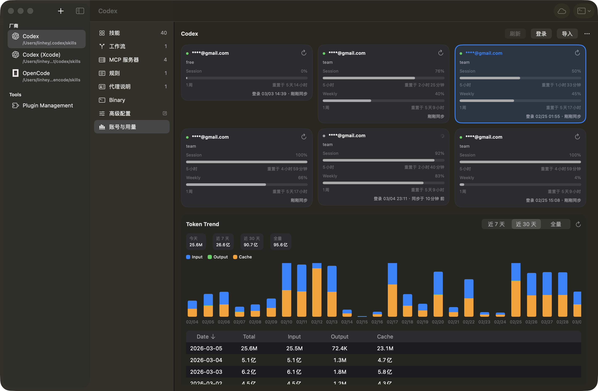

# Nolon

[English](README.md) | 中文

Nolon 是一款运行在 macOS 上的 AI 编程工作区编排器。它把 Skills / Workflows / MCP 统一维护在 `~/.nolon/skills`，再按 Provider 规则分发到 Codex、Claude Code、Cursor 等 25+ 工具。

## 为什么需要 Nolon

- 一次维护，多端复用：同一套资源可在多个 Provider 间复用。
- 降低配置漂移：集中管理软链、安装状态与修复流程。
- 减少切换成本：统一入口承接 Provider 差异能力。

## 核心能力

- 统一 Provider 管理：在一个工作区内管理 25+ AI 编程助手。
- 单一事实源：全局资源集中在 `~/.nolon/skills`。
- 资源中心：从 [Clawdhub](https://clawdhub.com) 发现并安装 Skills / Workflows / MCP。
- MCP 配置管理：按 Provider 维护配置与安装状态。
- Codex 专属能力：Rules / Agents / Binary / Advanced / Usage 配置链路。
- 迁移与修复：检测并修复孤立资源和损坏链接。

## 下载

- 最新版本：https://github.com/linhay/nolon/releases/latest
- Sparkle 更新源：https://linhay.github.io/nolon/appcast.xml
- 项目主页：https://linhay.github.io/nolon/

## 5 分钟快速开始

1. 从 release 页面下载并安装 Nolon。
2. 启动后选择一个 Provider（例如 Codex）。
3. 打开 Resource Center，安装一个 Skill 或 MCP。
4. 返回 Provider 标签页确认资源可见并可编辑配置。
5. 若检测到历史漂移，执行迁移/修复流程完成收敛。

## 典型使用路径

### 1) 安装 Skills

1. 在左侧选择目标 Provider。
2. 打开 Resource Center，筛选并安装技能。
3. 回到 `Skills` 标签确认已生效。

### 2) 配置 MCP

1. 进入 Provider 的 `MCP` 标签。
2. 新增或修改 MCP 配置项。
3. 验证配置文件路径与运行状态。

### 3) 迁移与修复

1. 扫描未纳管/孤立资源。
2. 执行批量迁移或修复损坏链接。
3. 再次扫描确认工作区健康。

## 界面总览


工作区内容视图：能力标签栏 + 资源详情面板。


资源中心：统一发现和安装 Skills / Workflows / MCP。


Provider 能力面：高级配置面板，用于管理 Provider 运行参数。


Provider 能力面：账号与用量看板，展示 Token 趋势与会话状态。

## 开发者入口

环境要求：
- macOS 15.0+
- Xcode 16.0+

构建：

```bash
git submodule update --init --recursive
./build.sh
```

或：

```bash
xcodebuild -project nolon.xcodeproj -scheme nolon -configuration Release
```

Providers 包测试：

```bash
swift test --package-path libs/Providers
```

## 文档索引

- 功能规格：[`docs-linhay/features/`](docs-linhay/features/)
- 研发文档：[`docs-linhay/dev/`](docs-linhay/dev/)
- API 文档：[`docs-linhay/dev/api/`](docs-linhay/dev/api/)
- 运维发布：[`docs-linhay/dev/ops/`](docs-linhay/dev/ops/)

## 常见问题

### 为什么要统一到 `~/.nolon/skills`？

因为这是一份可复用、可迁移、可修复的单一事实源，能显著降低多 Provider 并行使用时的重复维护成本。

### README 为什么不放路线图和详细变更？

README 只保留稳定入口信息。时效性内容统一放在 `docs-linhay/dev/ops/`，避免首页失真和长期维护负担。

## License

本项目基于 GNU General Public License v3.0（GPL-3.0）。详情见 [`LICENSE`](LICENSE)。
