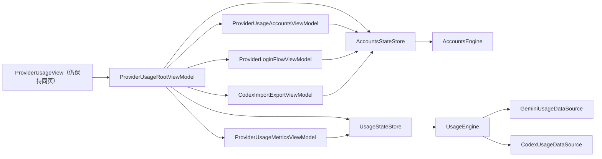

# Provider Usage 页面边界与业务域拆分设计（2026-04-15）

## 背景

围绕 `Provider Usage` 的页面边界，本轮已经通过多轮 debate 收敛出一个关键结论：

1. 现在不建议把“账号”和“用量”直接拆成两个页面。
2. 但从代码职责看，`usage` 已经不是账号页里的一个普通子区块，而是横跨“账号激活态”和“session / cost 数据源”的独立业务域。

关联辩论文档：

- `docs-linhay/debate/20260415/accounts-vs-usage-page-split/20260415-accounts-vs-usage-page-split-v01.md`

## 当前代码事实

### 1. 当前 UI 是综合页，不是两个独立页面

1. [`ProviderUsageView.swift`](/Users/linhey/Desktop/FlowUp-Libs/nolon/nolon/Skills/Domain/Providers/Usage/Views/Common/ProviderUsageView.swift#L194) 使用同一个 `ProviderUsageScreenScaffold` 承载内容。
2. [`ProviderUsageView.swift`](/Users/linhey/Desktop/FlowUp-Libs/nolon/nolon/Skills/Domain/Providers/Usage/Views/Common/ProviderUsageView.swift#L643) 的 `usageContent` 在同一个 `LazyVStack` 中先渲染账号区，再渲染 `tokenTrendSection`。
3. [`ProviderUsageRootViewModel.swift`](/Users/linhey/Desktop/FlowUp-Libs/nolon/nolon/Skills/Domain/Providers/Usage/Root/ProviderUsageRootViewModel.swift#L27) 对 codex 直接使用“账号与用量”标题。

结论：

- 当前产品语义是“同页综合展示”。
- 只改路由拆页面，并不会天然让代码边界变好。

### 2. 当前真正耦合的是状态与加载链路

1. [`ProviderUsageRootViewModel.swift`](/Users/linhey/Desktop/FlowUp-Libs/nolon/nolon/Skills/Domain/Providers/Usage/Root/ProviderUsageRootViewModel.swift#L110) 的 `load()/loadIfNeeded()` 只走 `accountsViewModel`。
2. [`ProviderUsageSubViewModels.swift`](/Users/linhey/Desktop/FlowUp-Libs/nolon/nolon/Skills/Domain/Providers/Usage/Root/ProviderUsageSubViewModels.swift#L578) 与 [`ProviderUsageSubViewModels.swift`](/Users/linhey/Desktop/FlowUp-Libs/nolon/nolon/Skills/Domain/Providers/Usage/Root/ProviderUsageSubViewModels.swift#L648) 显示账号 VM 与趋势 VM 都共享 `state.commonEngine`。
3. [`ProviderUsageEngine.swift`](/Users/linhey/Desktop/FlowUp-Libs/nolon/nolon/Skills/Domain/Providers/Usage/Engine/ProviderUsageEngine.swift#L493) 的 `load()` 会在 codex / gemini 下并行触发 `refreshTokenTrend()`。

结论：

- 当前不是“两个 feature 放在同一页”，而是“一个大 engine 里并排暴露了两组 UI 接口”。
- 如果现在先拆页面，结果大概率会变成“两个页面共用同一坨状态和加载入口”。

### 3. `usage` 已经跨到 session / cost 数据域

1. [`GeminiTokenTrendService.swift`](/Users/linhey/Desktop/FlowUp-Libs/nolon/libs/Providers/Sources/ProviderUsage/GeminiTokenTrendService.swift#L52) 会先校验 active account，再扫描 `.gemini` 下的 `session-*.json` 来聚合日级趋势。
2. [`GeminiIntradayUsageService.swift`](/Users/linhey/Desktop/FlowUp-Libs/nolon/libs/Providers/Sources/ProviderUsage/GeminiIntradayUsageService.swift#L52) 会从同一批 session 事件里派生分钟级 bucket。
3. [`CodexTokenTrendService.swift`](/Users/linhey/Desktop/FlowUp-Libs/nolon/libs/Providers/Sources/ProviderUsage/CodexTokenTrendService.swift#L26) 通过 `CostUsageFetcher` 装配 daily trend。
4. [`CostUsageFetcher.swift`](/Users/linhey/Desktop/FlowUp-Libs/nolon/libs/Providers/Sources/Providers/Codex/CostUsage/CostUsageFetcher.swift#L26) 直接面向 `sessions` / `cache` 扫描链路。
5. [`CodexIntradayUsageService.swift`](/Users/linhey/Desktop/FlowUp-Libs/nolon/libs/Providers/Sources/ProviderUsage/CodexIntradayUsageService.swift#L58) 则通过 quarter-hour usage fetcher 构建 intraday snapshot。

结论：

- `usage` 的事实来源已经不是账号卡片本身，而是 provider 对应的 session / usage cache / cost scanner。
- 从领域建模看，`usage` 应被提升为独立业务域。

## 设计裁定

### 页面边界

1. 当前阶段保持“账号 + 用量”同页。
2. 不把“拆 UI 页面”作为第一优先级。

### 代码边界

优先把当前 `ProviderUsage` 从“页面综合体”拆成三个明确职责：

1. `AccountsFeature`
   - 账号加载
   - 激活 / 删除 / 登录
   - 导入导出
   - 账号卡片展示状态

2. `UsageFeature`
   - daily trend
   - intraday drilldown
   - `range / selectedDay / bucket / snapshot / loading / error`

3. `SessionUsageData`
   - 从 provider 的 session / cost cache 装配 usage snapshot
   - 不关心页面，也不关心账号卡片布局

## 目标架构

说明：

1. `ProviderUsageView` 是否拆页面，不再决定底层状态边界。
2. 即使继续同页，也应该让账号和用量分别拥有独立的 store / engine / load 入口。
3. 当未来真的有 UI 拆页诉求时，只需要改路由，不需要再重做 usage 数据链。

## 重构原则

1. 先拆 domain，再决定是否拆 UI。
2. `accounts` 与 `usage` 必须拥有独立的 load / refresh 入口。
3. `UsageFeature` 不得反向依赖账号卡片展示模型。
4. provider-specific usage 聚合逻辑必须下沉在 `libs/Providers`，不得回流到 App 层临时扫描文件。
5. 日级和分钟级必须共享同一 usage 数据装配链，不允许页面拆分后出现两套并行事实源。

## 非目标

1. 本文档不主张当前版本立即把账号和用量拆成两个页面。
2. 本文档不要求一次性重做所有 `ProviderUsageEngine` 内部逻辑。
3. 本文档不改变已有 intraday drilldown 的产品规格。
