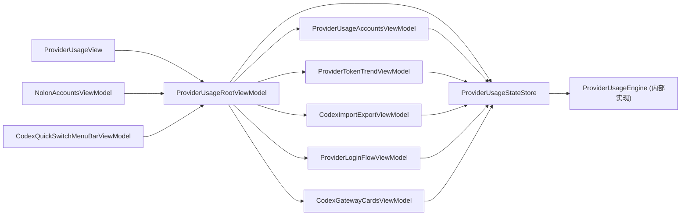

# ProviderUsageViewModel 业务域拆分设计（2026-03-25）

## 1. 现状问题
1. `ProviderUsageViewModel` 体量过大（约 4.8k 行），包含账号、登录、导入导出、网关、趋势图等多域职责。
2. `ProviderUsageView`、`NolonAccountsViewModel`、`CodexQuickSwitchMenuBarViewModel` 同时耦合到同一个 VM，跨页面影响面大。
3. 静态策略/格式化逻辑与编排状态混在一起，测试边界不清晰，重构成本高。

## 2. 目标架构图

说明：Root 对外只暴露 5 个子 VM；旧 `ProviderUsageViewModelStore` 与 `root.legacyViewModel` 已移除，去桥接化完成。

## 3. 子 VM 边界
1. `ProviderUsageAccountsViewModel`
- 账号加载、激活、删除、Header refresh、账号只读摘要。

2. `ProviderTokenTrendViewModel`
- `range/snapshot/error/loading` 读写与刷新入口。

3. `CodexImportExportViewModel`
- 导入 Sheet 状态、候选分组只读、导入导出流程入口。

4. `ProviderLoginFlowViewModel`
- CLI/AppServer/Gemini 登录流程、URL sheet 状态、取消登录入口。

5. `CodexGatewayCardsViewModel`
- 网关卡片列表与状态、清理/激活卡片选择入口。

## 4. 状态字段归属表
| 字段域 | 归属 | 说明 |
|---|---|---|
| `provider/usageProvider` | `ProviderUsageStateStore` | 根级共享只读上下文 |
| `outcomes/codexAccounts/codexAccountOutcomes` | `AccountsVM` | 账号与 usage 主域 |
| `tokenTrend*` | `TokenTrendVM` | 趋势图专属状态 |
| `codexImport*` | `ImportExportVM` | 导入导出专属状态 |
| `isRunningCLILogin/loginURL*` | `LoginFlowVM` | 登录流程状态 |
| `gatewayCardsState/gatewayCards` | `GatewayCardsVM` | 网关卡片状态 |

## 5. 迁移顺序
1. 新增 `Root + StateStore + 5 子VM + RootStore`，并将旧 VM 收敛为 State 内部实现细节。
2. 抽离策略与格式化组件：
- `ProviderUsageErrorFormatter`
- `ProviderUsageOutcomeFilter`
- `CodexAccountSectionBuilder`
- `CodexConfigDraftCodec`
3. 消费者迁移：
- `ProviderUsageView` 持有 `RootVM + 5 子VM` 显式接口（移除 dynamicMember 泛透传）。
- `NolonAccountsViewModel` 改为持有 `RootVM`，账号行为走 `accountsVM/gatewayVM`。
- `CodexQuickSwitchMenuBarViewModel` 改为依赖 `RootVM.accountsVM`。
4. 清理桥接层：删除 `ProviderUsageViewModelStore`、删除 `root.legacyViewModel` 对外门面、测试改为校验 `root.state` 一致性。

## 6. 测试矩阵
1. 新增：
- `ProviderUsageRootViewModelStoreTests`
- `ProviderUsageSubViewModelWiringTests`
- `ProviderUsageAccountsViewModelParityTests`
- `ProviderUsageLoginFlowViewModelParityTests`
- `CodexGatewayCardsViewModelParityTests`
- `CodexImportExportViewModelParityTests`
- `ProviderTokenTrendViewModelParityTests`
- `NolonAccountsViewModelIntegrationTests`
- `CodexQuickSwitchMenuBarViewModelTests`

2. 现有回归：
- `NolonAccountsViewModelTests`
- `CodexAuthServiceTests`
- `CodexUsageTabPresentationTests`

## 7. 风险与回滚
1. 风险：State 内部实现仍依赖旧大 VM 逻辑，后续继续按域下沉时要防止行为漂移。
- 缓解：保持 parity/integration 测试常态化，按域逐步替换内部实现。
2. 风险：去桥接后 API 面更严格，新增字段若未暴露会在编译期直接失败。
- 缓解：保持子 VM 显式接口清单，新增 UI 依赖时同步更新并补测试。
3. 回滚：
- 若出现行为回退，可在 `ProviderUsageStateStore.engine` 内部回滚实现，不再恢复旧 Store/旧门面。
